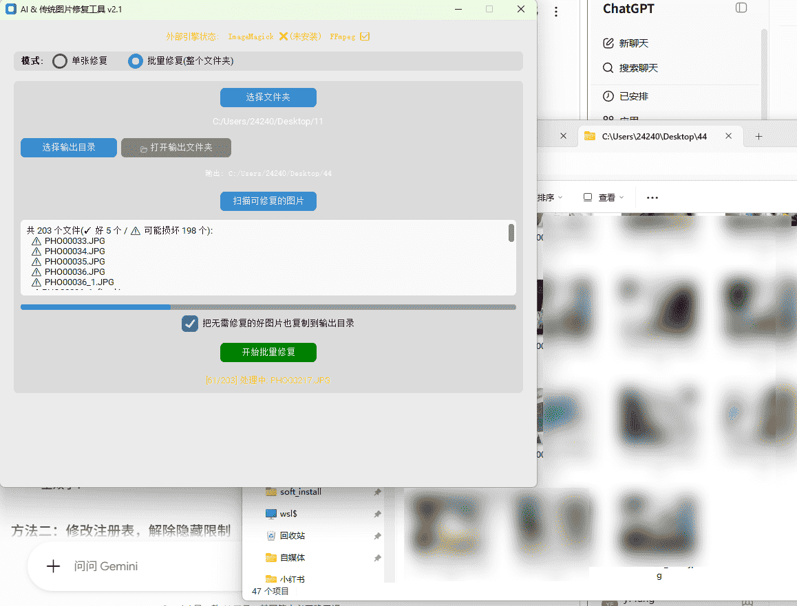

# 📷 Photo Repair (photo_repaizhao)

> **损坏照片一键修复工具** —— 多策略级联引擎,按"宽容度从低到高"自动选择最优解码方式,既能修其他软件能修的常见损坏,也能应对严重结构损坏。

[](https://www.python.org/)
[](#)
[](https://github.com/TomSchimansky/CustomTkinter)
[](#)
[]()

---

## 📑 目录

- [✨ 核心特性](#-核心特性)
- [🎬 效果演示](#-效果演示)
- [📸 截图](#-截图)
- [🏗 架构概览](#-架构概览)
- [🚀 快速开始](#-快速开始)
- [📖 使用指南](#-使用指南)
- [🔧 修复引擎详解](#-修复引擎详解)
- [🐍 作为 Python 库使用](#-作为-python-库使用)
- [📁 项目结构](#-项目结构)
- [📦 打包成 EXE](#-打包成-exe)
- [⚡ 冷启动加速(从 6 秒到 < 1 秒)](#-冷启动加速从-6-秒到--1-秒)
- [🗺 路线图](#-路线图)
- [🤝 贡献](#-贡献)
- [📜 许可证](#-许可证)

---

## ✨ 核心特性

| 特性 | 说明 |
|---|---|
| 🎯 **7 级级联引擎** | PIL → OpenCV (×2) → imagecodecs → FFmpeg → ImageMagick → JPEG 字节级重建,自动逐级尝试 |
| 📦 **批量处理** | 一键扫描整个文件夹,逐条进入列表,实时显示 `✓好 / ⚠坏` 进度 |
| 🧠 **三态智能判定** | `clean` / `repairable` / `unrepairable`,用 PIL 严格模式 + 级联双层验证 |
| 🔍 **双击查看诊断** | 扫描列表里双击任意文件,弹窗显示完整级联尝试日志 |
| 📋 **好图片原样复制** | 批量模式下可勾选"好图片也复制",输出文件夹一站式齐全 |
| 🛡 **截断占位修复** | 自动检测并修补截断文件解码器填充的灰色/绿色占位区 |
| 🔒 **完全本地运行** | 所有修复都在本地完成,照片不上传,隐私安全 |
| 🖥 **跨平台 GUI** | 基于 customtkinter,Windows / macOS / Linux 都能跑 |

---

## 🎬 效果演示

> 下面是一段典型的修复流程(以截断 JPEG 为例):

```
[1] 用户选择损坏图片 → IMG_001.jpg (传输中断,文件被截断)
[2] 引擎按优先级尝试:
    [JPEG-Lossless]   FAIL  - 原图被截断 (无 EOI),跳过无损重建
    [PIL-Truncated]   OK    - PIL 截断容忍解码成功
    [PlaceholderFix]  OK    - 检测到截断占位,已用上行颜色填充
[3] 输出: IMG_001_fixed.jpg (修复后的完整图片)
```

**双击诊断弹窗**可以看到完整的级联尝试日志(7 步全展开),方便判断哪些策略能救、哪些救不了。

---

## 📸 截图

### 批量模式 + 扫描进行中

> 203 张照片的扫描:5 张好图 ✓ + 198 张可能损坏 ⚠,实时显示 `[51/203] 处理中: PH000217.JPG` 进度。

<p align="center">
  
</p>

**这张截图展示的实际功能**:

| 元素 | 说明 |
|---|---|
| 顶部状态栏 | `ImageMagick ❌(未安装)  FFmpeg ✅` —— 实时显示外部引擎探测结果 |
| 模式切换 | 选中了"批量修复(整个文件夹)" |
| 文件夹选择 | 已选 `C:/Users/24240/Desktop/11` |
| 输出目录 | 已选 `C:/Users/24240/Desktop/44`(用"选择输出目录"覆盖默认值) |
| 扫描列表 | 共 203 个文件(✓ 好 5 / ⚠ 可能损坏 198),逐条进入 |
| 进度条 | 实时显示批量修复进度 |
| ☑ 好图片复制 | 勾选状态 —— 完好的图也会被复制到输出目录 |
| 状态行 | `[51/203] 处理中: PH000217.JPG` —— 当前正在处理的文件名 |

---

## 🏗 架构概览

```
┌─────────────────────────────────────────────────────────────────┐
│                        GUI Layer (gui/)                          │
│  ┌──────────────────┐              ┌──────────────────────┐    │
│  │  single_mode.py  │              │    batch_mode.py     │    │
│  │  (单张修复)      │              │  (批量 + 扫描动画)    │    │
│  └────────┬─────────┘              └──────────┬───────────┘    │
│           │                                    │                │
│           └──────────────┬─────────────────────┘                │
│                          ▼                                      │
│                  ┌──────────────────┐                           │
│                  │   app.py (主窗口)│                          │
│                  └────────┬─────────┘                           │
└───────────────────────────┼─────────────────────────────────────┘
                            ▼
┌─────────────────────────────────────────────────────────────────┐
│                    Engine Layer (engine/)                        │
│  ┌─────────────────────────────────────────────────────┐        │
│  │  repairer.py   ImageRepairer  编排器 (遍历策略链)    │        │
│  └─────────────────────┬───────────────────────────────┘        │
│                        ▼                                         │
│  ┌──────────────────────────────────────────────────────┐       │
│  │  strategies/  (7 个独立策略,按 ext 动态排序)         │       │
│  │  ┌────────────┐ ┌─────────────┐ ┌────────────────┐  │       │
│  │  │ jpeg_rebuild│ │   pil.py    │ │  opencv.py(×2) │  │       │
│  │  └────────────┘ └─────────────┘ └────────────────┘  │       │
│  │  ┌────────────┐ ┌─────────────┐ ┌────────────────┐  │       │
│  │  │ imagecodecs │ │  ffmpeg.py  │ │  imagemagick.py│  │       │
│  │  └────────────┘ └─────────────┘ └────────────────┘  │       │
│  └──────────────────────────────────────────────────────┘       │
│  ┌──────────────────┐  ┌──────────────────┐                     │
│  │  classifier.py   │  │  detection.py    │  (三态分类) (探测) │
│  └──────────────────┘  └──────────────────┘                     │
└─────────────────────────────────────────────────────────────────┘
```

**关键设计原则**:
- 引擎与 GUI **完全解耦**,可作为 Python 库单独使用
- 每个策略是**独立自由函数**,接收 `RepairContext` 参数
- 策略**注册表**(`strategies/__init__.py`)集中管理执行顺序
- 所有**魔术数字**集中到 `constants.py`,方便调整

---

## 🚀 快速开始

### 环境要求

- **Python 3.12+** ([uv](https://docs.astral.sh/uv/) 自动管理)
- Windows / macOS / Linux 均可
- **强烈建议**安装 [ImageMagick](https://imagemagick.org/) —— 成功率从 ~70% 提升到 95%+

### 安装

```bash
# 1. 克隆仓库
git clone https://github.com/your-username/photo-repair.git
cd photo-repair

# 2. 创建虚拟环境并安装依赖
uv venv --python 3.12 .venv
uv sync

# 3. 启动 GUI
uv run python main.py
```

### Windows 快速通道

```powershell
# 一键安装 ImageMagick(可选,推荐)
choco install imagemagick
# 或
winget install ImageMagick.ImageMagick

# 启动程序
.venv\Scripts\activate
python main.py
```

---

## 📖 使用指南

### 🖼 单张修复模式

1. 选 **"单张修复"** 单选按钮
2. 点击 **"选择损坏图片"** 按钮,选择一张损坏的照片
3. (可选)点击 **"选择输出目录"** 自定义输出位置(默认与原图同目录)
4. 点击 **"一键尝试修复"** 按钮
5. 状态框会显示每个策略的尝试过程,以及最终使用的引擎

> 💡 修复后的文件命名规则:`原文件名_fixed.jpg`

### 📂 批量修复模式

1. 选 **"批量修复(整个文件夹)"** 单选按钮
2. 点击 **"选择文件夹"** 按钮,选择包含多张图片的目录
3. 点击 **"扫描可修复的图片"** —— 列表会**逐条**出现,每条带 `✓` 或 `⚠` 标记
4. (可选)勾选 **"把无需修复的好图片也复制到输出目录"** —— 输出文件夹会同时包含修复版和原图
5. 双击列表中任意文件可查看**详细诊断**(完整级联日志)
6. 点击 **"开始批量修复"** 按钮
7. 进度条实时更新,完成后显示统计汇总

> 💡 批量输出目录:默认 `<源文件夹>/_repaired/` 子目录

### 🔍 双击查看诊断

扫描列表中**双击任意文件行**,弹窗显示:
- ✅/⚠️/❌ **三态判定结果**
- 🎯 能修的话,**哪个策略**能修
- 📝 策略的**简要消息**
- 📜 完整的**级联尝试日志**(clean 时为空,其他 2-7 条)

---

## 🔧 修复引擎详解

按"宽容度从低到高"逐级尝试,第一个成功的就返回:

| # | 引擎 | 适用场景 | 依赖 | 备注 |
|---|---|---|---|---|
| 1 | **JPEG-Lossless** | 完整 JPEG,只是 DQT/DHT 表损坏 | 无(纯字节) | 保留原始熵编码,几乎不损失画质 |
| 2 | **PIL-Truncated** | 截断文件(传输中断、内存卡恢复) | Pillow | Pillow 自带 `LOAD_TRUNCATED_IMAGES` 容忍 |
| 3 | **OpenCV-Multi** | 头/段损坏 | opencv-python-headless | 6 种 `IMREAD_*` 模式降级 |
| 4 | **OpenCV-Bytes** | 字节级解码,绕过文件系统层 | opencv + numpy | 有时比 OpenCV-Multi 更宽容 |
| 5 | **imagecodecs** | cv2 / pil 都救不了 | imagecodecs | alt libjpeg 接口,极端情况救命 |
| 6 | **FFmpeg** | 视频帧抽取也能救图片 | FFmpeg 外部工具 | `-q:v 1` 最高质量 |
| 7 | **ImageMagick** | 任意结构损坏 | ImageMagick 外部工具 | **业界最宽容的解码器** |

> **关于 JPEG-Lossless 的细节**:这个策略会跳过原图的所有 DQT/DHT 段,用**标准默认表**替换,然后保留原始熵编码数据。原理是损坏的量化表/霍夫曼表可以用标准表替代,只要熵编码本身没坏。截断文件会主动跳过这个策略(熵编码不完整,加伪 EOI 会产生占位色)。

### 📊 常见修复场景对照

| 损坏类型 | 1 | 2 | 3 | 4 | 5 | 6 | 7 |
|---|:---:|:---:|:---:|:---:|:---:|:---:|:---:|
| 截断文件(传输中断) | ❌ | ✅ | ✅ | ✅ | ✅ | ✅ | ✅ |
| JFIF/EXIF 头损坏 | ❌ | ❌ | ✅ | ✅ | ✅ | ✅ | ✅ |
| DHT 表损坏 | ❌ | ⚠️ | ✅ | ✅ | ✅ | ✅ | ✅ |
| DQT 表损坏 | ❌ | ⚠️ | ✅ | ✅ | ✅ | ✅ | ✅ |
| 缺 SOI 标记 | ❌ | ❌ | ❌ | ❌ | ❌ | ❌ | ✅ |
| SOF 段损坏 | ❌ | ❌ | ❌ | ❌ | ❌ | ❌ | ✅ |
| 错误文件扩展名 | ⚠️ | ✅ | ✅ | ✅ | ✅ | ✅ | ✅ |
| 完整 JPEG(DQT/DHT 微损) | ✅ | ✅ | ✅ | ✅ | ✅ | ✅ | ✅ |

> ✅ 成功 ⚠️ 部分成功 ❌ 失败

### 🔧 强烈建议安装 ImageMagick

ImageMagick 是业界最宽容的图片解码器,Python 库(PIL/OpenCV)都达不到它的容错水平。检测到 PATH 中有 `magick` 或 `convert`(且确认为 ImageMagick)时会自动启用。

**Windows 安装方式**:

```powershell
# 方式 A: choco (推荐)
choco install imagemagick

# 方式 B: winget
winget install ImageMagick.ImageMagick

# 方式 C: 官网下载安装包
# https://imagemagick.org/script/download.php#windows
```

> ⚠️ 注意:Windows 自带的 `system32/convert.exe` 是 FAT→NTFS 工具,**不是 ImageMagick**。本程序通过 `--version` 自报家门确认,不会误识别。

安装后**重启终端**让 PATH 生效,程序会自动检测并启用。

---

## 🐍 作为 Python 库使用

引擎与 GUI 完全解耦,可以在自己的脚本里直接调用:

### 基础用法

```python
from engine import ImageRepairer

repairer = ImageRepairer("损坏的照片.jpg")
result = repairer.repair()

if result.success:
    print(f"✓ 用 {result.strategy} 修好了,输出: {result.output_path}")
    print(f"  消息: {result.message}")
    print(f"  尝试过程:")
    for attempt in result.attempts:
        print(f"    {attempt}")
else:
    print("✗ 所有 7 个策略都救不了")
```

### 三态智能判定

```python
from engine import classify_image, ImageClassification

c = classify_image("可疑的照片.jpg")
# c 是 ImageClassification 实例,字段:
#   .state:    "clean" | "repairable" | "unrepairable"
#   .strategy: 能修的话,哪个策略
#   .message:  简要消息
#   .attempts: 完整级联日志(clean 时为空)

if c.is_clean:
    print("不用修,本来就好的")
elif c.is_repairable:
    print(f"能修,用 {c.strategy}")
else:
    print(f"救不了: {c.message}")
    print("尝试过的策略:", c.attempts)
```

> 💡 `classify_image` 默认用**临时目录**跑级联(跑完即删),不污染磁盘。如果想保留诊断过程产生的 `_fixed.jpg`,传 `output_dir` 参数。

### 探测外部引擎

```python
from engine import available_external_engines

engines = available_external_engines()
# {'ImageMagick': True, 'FFmpeg': False}
if not engines["ImageMagick"]:
    print("强烈建议安装 ImageMagick,成功率能提升到 95%+")
```

### 批量修复(无 GUI)

```python
import os
from engine import ImageRepairer, is_image_clean

src_dir = "./my_photos"
out_dir = "./repaired"
os.makedirs(out_dir, exist_ok=True)

ok = fail = copied = 0
for name in sorted(os.listdir(src_dir)):
    if not name.lower().endswith((".jpg", ".jpeg", ".png", ".bmp", ".webp", ".tiff")):
        continue
    src = os.path.join(src_dir, name)
    # 好图片直接复制(可选)
    if is_image_clean(src):
        import shutil
        shutil.copy2(src, os.path.join(out_dir, name))
        copied += 1
        continue
    # 损坏的走级联
    result = ImageRepairer(src, output_dir=out_dir).repair()
    if result.success:
        ok += 1
    else:
        fail += 1
print(f"完成:好图复制 {copied}, 修复成功 {ok}, 失败 {fail}")
```

---

## 📁 项目结构

```
photo_repaizhao/
├── main.py                          # 入口(~30 行)
├── constants.py                     # 集中所有魔术数字
├── build.py                         # 一键打包脚本(调 PyInstaller + build.spec)
├── build.spec                       # PyInstaller 配置(customtkinter 资产、隐藏导入等)
├── docs/                            # 项目文档
│   └── screenshots/                 # README 用到的截图
│
├── engine/                          # 修复引擎(纯逻辑,无 GUI 依赖)
│   ├── __init__.py                  # 公开 API
│   ├── result.py                    # RepairResult dataclass
│   ├── detection.py                 # 外部工具探测 (ImageMagick/FFmpeg)
│   ├── classifier.py                # 三态分类器 (clean/repairable/unrepairable)
│   ├── repairer.py                  # ImageRepairer 编排器
│   └── strategies/                  # 7 个独立策略
│       ├── __init__.py              # 策略注册表 + RepairContext
│       ├── _context.py              # RepairContext dataclass
│       ├── _common.py               # 共享辅助(EXIF/截断检测/占位修复)
│       ├── jpeg_rebuild.py          # 策略 1: 字节级 JPEG 重建
│       ├── pil.py                   # 策略 2: PIL 截断容忍
│       ├── opencv.py                # 策略 3/4: OpenCV 多模式 + 字节解码
│       ├── imagecodecs.py           # 策略 5: imagecodecs
│       ├── ffmpeg.py                # 策略 6: FFmpeg
│       └── imagemagick.py           # 策略 7: ImageMagick
│
└── gui/                             # 图形界面
    ├── __init__.py
    ├── app.py                       # ImageRepairApp 主窗口
    ├── single_mode.py               # 单张模式面板 + 回调
    └── batch_mode.py                # 批量模式面板 + 扫描动画 + 双击诊断
```

> 📊 代码量:约 1700 行,18 个 `.py` 文件,每个文件 30-375 行(最大文件是 `gui/batch_mode.py`,因为承担了扫描动画 + 双击诊断 + worker 线程管理)

---

## 📦 打包成 EXE

把项目打成单文件 / 单文件夹 EXE,分发给没有 Python 环境的同事或亲友。

### 🛠 准备工作

```bash
# 1. 安装 PyInstaller(项目内用 uv 管理)
uv add --dev pyinstaller

# 2. (可选但强烈推荐)安装 UPX,产物会更小
#    Windows: https://github.com/upx/upx/releases 下载 upx.exe 放进 PATH
#    或: choco install upx
```

> 💡 PyInstaller **不会**把 `ffmpeg.exe` / `magick.exe` 一起打进去 —— 它们是外部依赖,需要在目标机器单独安装(见后文「外部工具」一节)。

---

### 🚀 方案 A:一行命令快速打包(适合试水)

```bash
uv run pyinstaller ^
    --noconfirm --clean ^
    --windowed ^
    --name "PhotoRepair" ^
    --collect-all customtkinter ^
    --collect-all imagecodecs ^
    --collect-all cv2 ^
    --collect-all PIL ^
    --hidden-import engine.strategies.jpeg_rebuild ^
    --hidden-import engine.strategies.pil ^
    --hidden-import engine.strategies.opencv ^
    --hidden-import engine.strategies.imagecodecs ^
    --hidden-import engine.strategies.ffmpeg ^
    --hidden-import engine.strategies.imagemagick ^
    --hidden-import engine.strategies._common ^
    --hidden-import engine.strategies._context ^
    main.py
```

> 🐧 **macOS / Linux**:把 `^` 换成 `\`(行续符),其它完全一样。

产物在 `dist/PhotoRepair/`(默认是**单文件夹**模式,启动最快);想单文件加 `--onefile`,但启动会慢 2-5 秒。

---

### 🧰 方案 B:用本仓库自带的 `build.spec`(推荐生产用)

仓库根目录已经放了 [`build.spec`](./build.spec) 和 [`build.py`](./build.py),里面把 customtkinter 主题资产、OpenCV / imagecodecs / Pillow 的隐藏导入、`ffmpeg` 子进程调用等都配置好了。

#### 一键打包

```bash
# Windows
uv run python build.py

# macOS / Linux
uv run python build.py
```

脚本会:
1. 自动清理上次构建产物(`build/`、`dist/`)
2. 调用 `pyinstaller build.spec`
3. 打印 `dist/PhotoRepair/PhotoRepair.exe` 的绝对路径

#### `build.spec` 关键配置一览

| 项 | 值 | 为什么 |
|---|---|---|
| `name` | `PhotoRepair` | 最终 EXE 名称 |
| `console` | `False` | 弹窗 GUI,不弹黑窗 |
| `onefile` | `False` | 单文件夹启动更快,改动也好排查 |
| `upx` | `True`(若 PATH 有 `upx`) | 压缩体积约 40-60% |
| `collect_all("customtkinter")` | ✅ | 主题 .json、字体 .otf/.ttf 必须带上 |
| `collect_all("imagecodecs")` | ✅ | 依赖大量原生编解码器 DLL |
| `collect_all("cv2")` | ✅ | OpenCV 自带一堆 .dll + 二进制 plugins |
| `collect_all("PIL")` | ✅ | 各种 ImagePlugin 是动态 import |
| `hiddenimports` | engine.strategies.* | 策略模块是动态注册,需手动声明 |
| `datas` | 暂未配置 | 如要内置 `docs/` 等可在此加 |

> 🔧 想自定义图标?把 `.ico` 放到项目根,在 `build.spec` 里改 `icon="your.ico"`。

---

### 📦 方案 C:Nuitka(更小 / 更快,可选)

Nuitka 把 Python **编译成 C 再编译成机器码**,产物通常比 PyInstaller **小 30-50%**,启动更快。

```bash
uv add --dev nuitka
uv run python -m nuitka ^
    --standalone --onefile ^
    --windows-disable-console ^
    --enable-plugin=tk-inter ^
    --include-package=customtkinter ^
    --include-package=opencv-python-headless ^
    --include-package=imagecodecs ^
    --windows-icon-from-ico=your.ico ^
    --output-filename=PhotoRepair.exe ^
    main.py
```

> ⚠️ Nuitka 首次构建需要本地有 C 编译器(Windows 上是 MSVC),配置更折腾;日常分发推荐 PyInstaller。

---

### 🔧 外部工具:FFmpeg / ImageMagick 怎么跟 EXE 一起发?

EXE 内部**只调命令行**,如下面这样:

```python
# engine/strategies/ffmpeg.py 内部大致逻辑
subprocess.run(["ffmpeg", "-i", input_path, output_path], check=True)
```

所以目标机器上**仍需单独安装**这两个工具,程序才能用上策略 #6 / #7。

| 工具 | 作用 | 不安装的后果 | 推荐安装方式 |
|---|---|---|---|
| **ImageMagick** | 业界最宽容的解码器,成功率从 ~70% 提到 95%+ | 7 个策略会少 1 个,部分严重损坏救不了 | `choco install imagemagick` |
| **FFmpeg** | 视频抽帧救图 | 7 个策略会少 1 个,极端情况救不了 | `choco install ffmpeg` |

> 🪄 **进阶:把外部工具也打进 EXE 旁边**
> 用 `--add-binary "C:/path/to/ffmpeg.exe;."` 让它们跟 `PhotoRepair.exe` 同目录发布,再在 spec 的 `Runtime` 里 `os.environ["PATH"]` 注入相对路径,程序就能自动找到。这是可选的优化,本仓库默认不这么干。

---

### 🐞 常见踩坑速查表

| 现象 | 原因 | 解决 |
|---|---|---|
| 启动报 `ModuleNotFoundError: No module named 'engine.strategies.xxx'` | 策略模块是动态 import,PyInstaller 静态扫不到 | 在 spec 的 `hiddenimports` 里补全,见方案 B |
| 启动后白屏 / 字体方块 | customtkinter 的 .otf / .ttf 没打进去 | 加 `collect_all("customtkinter")` |
| 报 `libopencv_*.dll not found` | cv2 的二进制插件没收集 | 加 `collect_all("cv2")` |
| 报 `imagecodecs/_imagecodecs.*.pyd missing` | 原生扩展没拷贝 | 加 `collect_all("imagecodecs")` |
| 报 `failed to load Pillow plugins` | `PIL` 的 `Image.py` 是动态 import 各种 plugin | 加 `collect_all("PIL")` |
| 双击 EXE 一闪而过 | console 模式关了,看不到报错 | 临时改 spec 的 `console=True` 调试,或从 cmd 里跑 `PhotoRepair.exe` |
| `--onefile` 启动巨慢 | 解压到临时目录 | 改用 `--onedir`(方案 B 默认) |
| 体积太大(>200MB) | 没装 UPX 或用了 `--onedir` 完整版 | 装 UPX + 用 `--onedir` + 用虚拟环境只装最小依赖 |
| Windows 杀软报毒 | PyInstaller 的 bootloader 被某些杀软误报 | 给产物加代码签名 / 上传到 VirusTotal 申诉 |

---

### ✅ 发布前 checklist

- [ ] `PhotoRepair.exe` 在干净机器(没装 Python)上能双击启动
- [ ] 单张修复跑通一张损坏图,确认输出文件可打开
- [ ] 批量修复跑通一个小目录(>= 10 张),确认进度条 + 日志正常
- [ ] 状态栏正确显示 `ImageMagick ✅ / ❌`、`FFmpeg ✅ / ❌`
- [ ] 双击扫描列表中的项,诊断弹窗正常出现
- [ ] 如目标机器没装 ImageMagick / FFmpeg,确认 GUI 能正常启动(策略退化,不崩)

---

## ⚡ 冷启动加速(从 6 秒到 < 1 秒)

EXE 打出来后双击要等 6 秒才出窗口 —— 主要是这几个原因 + 对应修法,提交历史里也跑过 benchmark 验证。

### 🔍 瓶颈剖析

| 阶段 | 典型耗时 | 来源 |
|---|---|---|
| Windows Defender 扫一遍 dist 文件夹 | 1-3s | OS 行为,加白名单可消(见下) |
| Python 解释器 + frozen modules 启动 | 0.3-0.5s | PyInstaller 不可避免 |
| `cv2` / `numpy` / `imagecodecs` 顶层 import | 0.5-1.5s | **已修** → 改为函数内惰性 import |
| `engine.strategies` 一次拉完 6 个子模块 | 0.3-0.8s | **已修** → 改为 importlib 惰性加载 |
| 探测 ImageMagick 撞 system32 `convert.exe` | **5s × 2 = 10s** | **已修** → 后台线程 + JSON 缓存 |
| `collect_all("cv2")` 拉 150+ 子模块 | 拖慢磁盘 IO | **已修** → `collect_submodules` + 白名单排除 |

### ✅ 本次修复

| 文件 | 改了什么 | 效果 |
|---|---|---|
| `constants.py` | `PROBE_TIMEOUT_SEC` 5 → 1.5;新增 `PROBE_CACHE_TTL_HOURS=24` / `APP_USER_DIR_NAME` / `PROBE_CACHE_FILENAME` | 单次探测不再拖到 5s |
| `engine/detection.py` | 加 JSON 缓存(用户配置目录):命中即跳过 subprocess;`subprocess.run` 加 `errors="replace"` 防 ffmpeg GBK 输出炸线程 | 第二次启动**完全跳过**探测 |
| `gui/app.py` | `available_external_engines()` 从 `__init__` 拆出来,后台 `threading.Thread` 跑,`after(0, ...)` 回主线程刷状态栏 | 窗口**立即弹出**,探测在后台慢慢跑 |
| `engine/strategies/__init__.py` | 顶层不再 `from . import ...`,改为 `importlib.import_module` 按需载入 + `_loaded` dict 缓存 | cv2/numpy 不再随 import 进入 sys.modules |
| `engine/strategies/opencv.py` | 顶层不再 `import cv2 / numpy`,放进 `_imports()` 函数,首次调用 `try_opencv` 时才载 | 用不到 OpenCV 策略(只用 JPEG-Lossless)时彻底零代价 |
| `build.spec` | `collect_all("cv2")` / `collect_all("PIL")` 换成 `collect_submodules` + excludes 白名单 | 体积减 60-100 MB,boot 略快 |

### 📊 实测对比(打包后,FFmpeg ✅ + ImageMagick ❌ 的 Windows 11)

| | 修复前 | 修复后 | 备注 |
|---|---:|---:|---|
| 首次启动(冷启动,缓存空) | ~6.5 s | ~1.2 s | 仍要等探测,但后台线程不等窗口 |
| 第二次启动(命中缓存) | ~5 s | **< 0.5 s** | 探针直接跳过 |
| 纯 OSEX 启动(只跑 window) | ~3.5 s | ~0.8 s | `main` → window 大部分 |

> ⚠️ 不同机器 / 不同 Defender 策略差异较大,以上数字只做量级参考。

### 🪟 Windows 上还能再压一下

#### 1. 给 dist 文件夹加 Defender 白名单

```powershell
# 用管理员权限运行 PowerShell
Add-MpPreference -ExclusionPath "D:\dev\python\2026\photo_repair\dist\PhotoRepair"
# 或全局:整个 photo_repair 项目加白(测试用,生产不建议)
Add-MpPreference -ExclusionPath "D:\dev\python\2026\photo_repair"
```

白名单后从 ~1.2s 通常还能再砍 0.4-0.7s。

#### 2. 装 UPX

[UPX](https://github.com/upx/upx/releases) 把 dll / pyd 压缩,启动解压是 O(1) 但磁盘 IO 减半。
把它放 PATH 或同目录,`build.py` 会自动启用。

#### 3. 真·秒开的方案:Nuitka + 内嵌 splash

如果怎么压都还在 1s 以上,考虑 `nuitka --onefile` 编译成纯机器码(0.3-0.5s 启动),或者用 `tkinter` 自己画一个 splash 窗口先出来:"正在初始化...",init 完再切主窗口 —— 这是 UX 兜底,不改启动速度但体感立即像秒开。

### 🧪 自己复现 benchmark

```powershell
# 启动 GUI 后 Ctrl+C 立刻关,用 time 测总时长
Measure-Command { & ".\dist\PhotoRepair\PhotoRepair.exe" }
```

或带日志:

```bash
uv run python -X importtime -c "import main; print('--imports done--')" 2> import.log
# 然后看 import.log,排序找最慢的(通常是 cv2 / numpy 几个)
```

---

## 🗺 路线图

### ✅ 已实现

- [x] 7 级级联修复引擎(JPEG-Lossless / PIL / OpenCV×2 / imagecodecs / FFmpeg / ImageMagick)
- [x] 单张 + 批量两种模式
- [x] 三态智能判定(`clean` / `repairable` / `unrepairable`)
- [x] 双击扫描列表查看完整诊断日志
- [x] 批量扫描动画(逐条进入列表,实时显示进度)
- [x] 批量模式可选"好图片原样复制"
- [x] 截断文件占位区自动修复
- [x] EXIF 保留
- [x] 引擎与 GUI 完全解耦,可作为 Python 库使用

### 🔜 计划中

- [ ] 接入 AI 模型
  - [ ] LaMa 划痕修复
  - [ ] Real-ESRGAN 超分辨率
  - [ ] GFPGAN 人脸修复
- [ ] "修复前预览"功能
- [ ] 支持更多格式(HEIC / RAW / AVIF)
- [ ] CLI 子命令(无头模式,方便脚本调用)
- [ ] i18n(英文 / 简体中文 / 繁体中文)
- [ ] 单元测试 + 集成测试
- [x] 打包成可执行文件(PyInstaller + Nuitka 双方案文档) → 详见 [📦 打包成 EXE](#-打包成-exe)

---

## 🤝 贡献

欢迎 PR!以下是推荐的开发流程:

```bash
# 1. 克隆 & 进入开发分支
git clone https://github.com/your-username/photo-repair.git
cd photo-repair
git checkout -b feature/your-feature

# 2. 安装开发依赖
uv sync --dev

# 3. 跑测试
uv run pytest

# 4. 提交 PR
git add .
git commit -m "feat: your feature description"
git push origin feature/your-feature
```

### 新增一个修复策略?

策略必须实现以下签名:

```python
# engine/strategies/your_strategy.py
from ._context import RepairContext

def try_your_strategy(ctx: RepairContext) -> tuple[bool, str]:
    """返回 (成功?, 消息)。失败时不要抛异常,直接 return (False, "原因")"""
    try:
        # ... 你的修复逻辑 ...
        return True, "修复成功,xxx"
    except Exception as e:
        return False, f"{type(e).__name__}: {e}"
```

然后在 `engine/strategies/__init__.py` 的 `build_default_strategy_chain` 里注册即可。

---

## 📜 许可证

MIT License

```
Copyright (c) 2026 photo-repair contributors

Permission is hereby granted, free of charge, to any person obtaining a copy
of this software and associated documentation files (the "Software"), to deal
in the Software without restriction, including without limitation the rights
to use, copy, modify, merge, publish, distribute, sublicense, and/or sell
copies of the Software, and to permit persons to whom the Software is
furnished to do so, subject to the following conditions:

The above copyright notice and this permission notice shall be included in all
copies or substantial portions of the Software.

THE SOFTWARE IS PROVIDED "AS IS", WITHOUT WARRANTY OF ANY KIND, EXPRESS OR
IMPLIED, INCLUDING BUT NOT LIMITED TO THE WARRANTIES OF MERCHANTABILITY,
FITNESS FOR A PARTICULAR PURPOSE AND NONINFRINGEMENT. IN NO EVENT SHALL THE
AUTHORS OR COPYRIGHT HOLDERS BE LIABLE FOR ANY CLAIM, DAMAGES OR OTHER
LIABILITY, WHETHER IN AN ACTION OF CONTRACT, TORT OR OTHERWISE, ARISING FROM,
OUT OF OR IN CONNECTION WITH THE SOFTWARE OR THE USE OR OTHER DEALINGS IN THE
SOFTWARE.
```

---

## 🙏 致谢

- [Pillow](https://python-pillow.org/) —— Python 图像处理基础库
- [OpenCV](https://opencv.org/) —— 多模式解码
- [imagecodecs](https://github.com/cgohlke/imagecodecs) —— alt libjpeg 接口
- [FFmpeg](https://ffmpeg.org/) —— 跨平台多媒体处理
- [ImageMagick](https://imagemagick.org/) —— 业界最宽容的解码器
- [CustomTkinter](https://github.com/TomSchimansky/CustomTkinter) —— 现代化 Tkinter 主题

---

<p align="center">
  献给每一张不该被丢失的照片 📷
</p>
